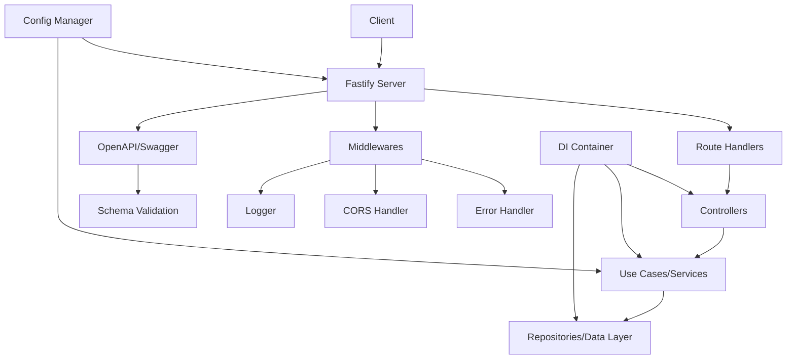
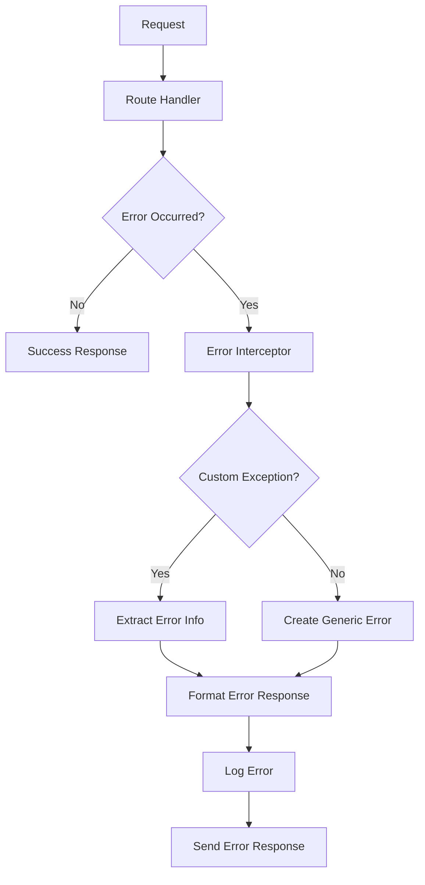

# Design Document

## Overview

本設計文件描述了基於 Fastify 的 TypeScript 伺服器架構，參考 starter-ts-koa 專案的設計模式，提供一個現代化、可擴展的 Web API 伺服器解決方案。

### 核心技術棧
- **Fastify**: 高效能的 Node.js Web 框架
- **TypeScript**: 類型安全的 JavaScript 超集
- **tsyringe**: 依賴注入容器
- **@fastify/swagger**: OpenAPI 文件生成
- **Vitest**: 測試框架
- **ESBuild**: 快速建置工具

## Architecture

### 整體架構圖



### 目錄結構

```
src/
├── main.ts                 # 應用程式入口點
├── server.ts               # Fastify 伺服器設定
├── configs.ts              # 環境配置管理
├── fastifyApp.ts           # Fastify 應用程式初始化
├── openapi.ts              # OpenAPI/Swagger 設定
├── common/                 # 共用元件
│   ├── decorators/         # 自定義裝飾器
│   ├── dto/                # 資料傳輸物件
│   ├── enums/              # 列舉定義
│   ├── exceptions/         # 自定義例外
│   ├── interceptors/       # 攔截器
│   ├── middlewares/        # 中介軟體
│   └── types/              # 類型定義
├── delivery/               # 交付層
│   └── controllers/        # API 控制器
├── modules/                # 業務模組
│   ├── app/                # 應用程式模組
│   ├── health/             # 健康檢查模組
│   └── demo/               # 示例模組
├── ioc/                    # 依賴注入設定
│   ├── iocAdapter.ts       # DI 容器適配器
│   └── ioc.register.app.ts # 服務註冊
└── utils/                  # 工具函數
    ├── demo/               # 示例工具
    ├── ioc/                # DI 工具
    └── time/               # 時間工具
```

## Components and Interfaces

### 1. 伺服器核心元件

#### FastifyApp 初始化器
```typescript
interface FastifyAppOptions {
  controllers: any[];
  middlewares: any[];
  isApiDocEnabled?: boolean;
}

interface FastifyAppInitializer {
  initFastifyApp(options: FastifyAppOptions): FastifyInstance;
}
```

#### 伺服器管理器
```typescript
interface ServerManager {
  start(): Promise<void>;
  stop(): Promise<void>;
  getServer(): FastifyInstance;
}
```

### 2. 依賴注入系統

#### DI 容器適配器
```typescript
interface DIAdapter {
  get<T>(token: string | symbol): T;
  resolve<T>(target: any): T;
}
```

#### 服務註冊器
```typescript
interface ServiceRegistry {
  register(): void;
  registerSingleton<T>(token: string | symbol, implementation: any): void;
}
```

### 3. 控制器系統

#### 基礎控制器
```typescript
interface BaseController {
  // 基礎控制器介面，提供共用功能
}
```

#### 健康檢查控制器
```typescript
interface HealthController {
  getHealth(): Promise<HealthInfoDTO>;
}
```

### 4. 中介軟體系統

#### 錯誤處理中介軟體
```typescript
interface ErrorHandler {
  handle(error: Error, request: FastifyRequest, reply: FastifyReply): void;
}
```

#### 回應時間中介軟體
```typescript
interface ResponseTimeMiddleware {
  process(request: FastifyRequest, reply: FastifyReply): Promise<void>;
}
```

### 5. OpenAPI 系統

#### Swagger 設定
```typescript
interface SwaggerConfig {
  routePrefix: string;
  exposeRoute: boolean;
  swagger: {
    info: {
      title: string;
      version: string;
      description: string;
    };
  };
}
```

## Data Models

### 1. 配置模型

```typescript
interface AppConfig {
  env: string;
  name: string;
  version: string;
  description: string;
  host: string;
  port: number;
  tz?: string;
}
```

### 2. API 回應模型

```typescript
interface ApiResponse<T = any> {
  success: boolean;
  status: number;
  data?: T;
  message?: string;
  timestamp: Date;
}

interface ApiErrorResponse {
  success: false;
  status: number;
  errorCode?: string;
  message: string;
  description?: string;
  method: string;
  path: string;
  timestamp: Date;
}
```

### 3. 健康檢查模型

```typescript
interface HealthInfo {
  status: 'ok' | 'error';
  timestamp: Date;
  uptime: number;
  version: string;
  environment: string;
}
```

### 4. 示例資料模型

```typescript
interface DemoData {
  id: string;
  name: string;
  value: any;
  createdAt: Date;
  updatedAt: Date;
}
```

## Error Handling

### 錯誤處理策略

1. **自定義例外類別**
   - `HttpException`: HTTP 錯誤的基礎類別
   - `ValidationException`: 資料驗證錯誤
   - `BusinessException`: 業務邏輯錯誤

2. **全域錯誤攔截器**
   - 捕獲所有未處理的例外
   - 轉換為標準化的錯誤回應格式
   - 記錄錯誤日誌

3. **錯誤回應格式**
   ```typescript
   {
     success: false,
     status: 400,
     errorCode: "VALIDATION_ERROR",
     message: "Invalid input data",
     description: "The provided email format is invalid",
     method: "POST",
     path: "/api/users",
     timestamp: "2024-01-01T00:00:00.000Z"
   }
   ```

### 錯誤處理流程



## Testing Strategy

### 測試架構

1. **單元測試**
   - 使用 Vitest 作為測試執行器
   - 測試個別函數和類別
   - 模擬依賴項目
   - 目標覆蓋率：80%+

2. **整合測試**
   - 測試 API 端點
   - 使用 Fastify 的測試工具
   - 測試完整的請求-回應流程

3. **測試工具和設定**
   ```typescript
   // 測試設定範例
   interface TestConfig {
     testEnvironment: 'node';
     setupFilesAfterEnv: string[];
     collectCoverageFrom: string[];
     coverageDirectory: string;
     coverageReporters: string[];
   }
   ```

### 測試結構

```
test/
├── unit/                   # 單元測試
│   ├── controllers/        # 控制器測試
│   ├── services/           # 服務測試
│   └── utils/              # 工具函數測試
├── integration/            # 整合測試
│   ├── api/                # API 端點測試
│   └── health/             # 健康檢查測試
├── fixtures/               # 測試資料
└── helpers/                # 測試輔助函數
```

### 測試範例

```typescript
// 控制器測試範例
describe('HealthController', () => {
  let controller: HealthController;
  let mockHealthUseCase: jest.Mocked<HealthUseCase>;

  beforeEach(() => {
    mockHealthUseCase = createMockHealthUseCase();
    controller = new HealthController(mockHealthUseCase);
  });

  it('should return health status', async () => {
    const expectedHealth = { status: 'ok', timestamp: new Date() };
    mockHealthUseCase.getHealthStatus.mockResolvedValue(expectedHealth);

    const result = await controller.getHealth();

    expect(result).toEqual(expectedHealth);
    expect(mockHealthUseCase.getHealthStatus).toHaveBeenCalled();
  });
});
```

## Implementation Considerations

### 1. 效能最佳化
- 使用 Fastify 的高效能特性
- 實作適當的快取策略
- 優化資料庫查詢
- 使用連接池管理

### 2. 安全性
- 實作 CORS 設定
- 加入請求速率限制
- 驗證和清理輸入資料
- 使用 HTTPS（生產環境）

### 3. 可維護性
- 遵循 SOLID 原則
- 使用依賴注入提高可測試性
- 實作清晰的分層架構
- 提供完整的 TypeScript 類型定義

### 4. 可擴展性
- 模組化設計
- 支援水平擴展
- 實作健康檢查端點
- 提供監控和日誌功能

### 5. 開發體驗
- 熱重載開發模式
- 完整的 TypeScript 支援
- 自動生成 API 文件
- 清晰的錯誤訊息